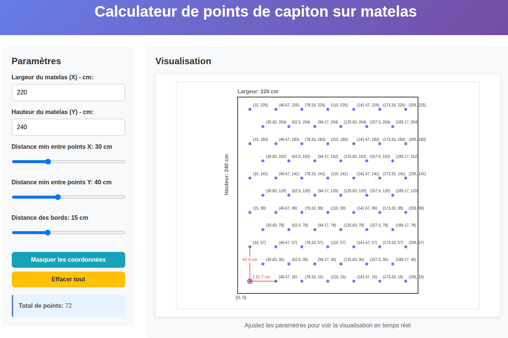

# Matelas Calculator - Button Point Visualization

A Flask web application that calculates and visualizes optimal button/tufting points on mattresses with real-time interactive controls.



## 🎯 Overview

This application helps determine the best placement of button points on rectangular mattresses, providing:

- **Real-time visualization** with interactive parameter adjustment
- **Canvas-based graphics** for accurate point positioning
- **Distance measurements** between adjacent points
- **Coordinate display** for precise positioning
- **Containerized deployment** for easy scaling

## ✨ Features

### 🔄 Real-time Interaction
- **Live parameter updates** - Instant visualization when adjusting dimensions or distances
- **No manual submission** - Automatic calculation on every input change
- **Smooth transitions** - Professional user experience

### 📊 Advanced Visualization
- **Canvas-based rendering** - High-quality graphics
- **Point highlighting** - First point emphasized with red circle
- **Distance measurements** - Real-time distance display between adjacent points
- **Coordinate toggle** - Show/hide coordinate labels
- **Responsive design** - Works on desktop and mobile devices

### 🎛️ Interactive Controls
- **Rectangle dimensions** - Width (X) and Height (Y) in centimeters
- **Distance sliders** - Minimum spacing between points (X and Y axes)
- **Edge distance** - Distance from rectangle edges for corner points
- **Real-time feedback** - Total point count and error handling

### 🐳 Deployment Ready
- **Multi-stage Dockerfile** - Optimized for production
- **Docker Compose** - Development and production configurations
- **Health checks** - Built-in monitoring
- **Security hardening** - Non-root user execution

## 🛠️ Technology Stack

### Backend
- **Python 3.9+** - Core calculation engine
- **Flask 3.0.0** - Web framework
- **Mathematical algorithms** - Precise point positioning

### Frontend
- **HTML5 Canvas** - Graphics rendering
- **Vanilla JavaScript** - Real-time interactivity
- **CSS3 Grid & Flexbox** - Responsive layout
- **Modern ES6+** - Clean, maintainable code

### DevOps
- **Docker** - Containerization and deployment
- **Docker Compose** - Multi-environment orchestration
- **Multi-stage builds** - Optimized container images

## 🚀 Quick Start

### Prerequisites
- Python 3.9 or higher
- Docker and Docker Compose (optional, for containerized deployment)

### Local Development

```bash
# Clone the repository
git clone https://github.com/PierreExeter/capitons-matelas.git
cd matelas-calc

# Create virtual environment
python -m venv venv
source venv/bin/activate  # On Windows: venv\Scripts\activate

# Install dependencies
pip install -r requirements.txt

# Run the application
python app.py
```

Access the application at: http://localhost:5000

### Docker Development

```bash
# Using Docker Compose
docker-compose up matelas-calc-dev

# Manual Docker build and run
docker build -t matelas-calc:latest .
docker run -p 5000:5000 --name matelas-calc matelas-calc:latest
```

For detailed Docker deployment instructions, see [README_DOCKER.md](README_DOCKER.md).

## 📖 Usage Guide

### Input Parameters

| Parameter | Description | Default | Range |
|-----------|-------------|----------|--------|
| **Largeur (X)** | Mattress width in cm | 220 | 0.01 - ∞ |
| **Hauteur (Y)** | Mattress height in cm | 240 | 0.01 - ∞ |
| **Distance min X** | Minimum horizontal point spacing | 30 | 1 - 100 cm |
| **Distance min Y** | Minimum vertical point spacing | 40 | 1 - 100 cm |
| **Distance des bords** | Distance from edges to corner points | 15 | 1 - 50 cm |

### Controls

#### **Sliders**
- **Range sliders** for distance adjustments with real-time value display
- **Number inputs** for precise dimension entry
- **Immediate updates** - No "Calculate" button needed

#### **Visualization Features**
- **Toggle coordinates** - Show/hide point coordinate labels
- **Clear all** - Reset visualization and data
- **Point highlighting** - First point always emphasized in red
- **Distance lines** - Red lines showing distances from point 1 to adjacent points

### Point Placement Algorithm

1. **Corner Points**: Four points at specified edge distance
2. **Even Rows**: Regular grid pattern including corners
3. **Odd Rows**: Staggered pattern for optimal spacing
4. **Horizontal Spacing**: `dx = (width - 2*edge_distance) / nb_points_x`
5. **Vertical Spacing**: `dy = (height - 2*edge_distance) / nb_points_y`

## 🔧 API Documentation

### Endpoints

#### `GET /`
- **Purpose**: Serve the main web interface
- **Response**: HTML page with interactive controls and canvas

#### `POST /calculate`
- **Purpose**: Calculate point positions based on input parameters
- **Request Body**: JSON with the following structure:
  ```json
  {
    "x": 220.0,
    "y": 240.0,
    "min_dist_x": 30.0,
    "min_dist_y": 40.0,
    "edge_distance": 15.0
  }
  ```
- **Response**: JSON with calculated points and rectangle info:
  ```json
  {
    "points": [
      [15.0, 15.0],
      [45.0, 15.0],
      [75.0, 15.0],
      ...
    ],
    "rectangle": {
      "x": 220.0,
      "y": 240.0
    }
  }
  ```
- **Error Response**: JSON with error message and HTTP 400 status

### Response Format

- **Points**: Array of `[x_coordinate, y_coordinate]` tuples
- **Coordinates**: Origin at bottom-left corner (0,0)
- **Precision**: Rounded to 2 decimal places

## 🏗️ Project Structure

```
matelas-calc/
├── app.py                 # Flask application and API
├── requirements.txt         # Python dependencies
├── templates/
│   └── index.html       # Main web interface
├── Dockerfile            # Multi-stage production container
├── docker-compose.yml     # Development/production orchestration
├── .dockerignore         # Docker build exclusions
├── .gitignore          # Git version control exclusions
├── README.md            # This file
└── README_DOCKER.md      # Docker deployment guide
```

## 🧪 Development

### Local Development Setup

```bash
# 1. Set up Python environment
python -m venv venv
source venv/bin/activate

# 2. Install dependencies
pip install -r requirements.txt

# 3. Run development server
python app.py
```

### Code Structure

- **`app.py`**: Flask routes, calculation logic, and API endpoints
- **`templates/index.html`**: Frontend interface with Canvas visualization
- **Modular design**: Clear separation of concerns

### Debug Mode

For development with debug features:

```bash
# Set debug environment
export FLASK_ENV=development
export FLASK_DEBUG=1

# Or run with Docker Compose
docker-compose up matelas-calc-dev  # Includes debug configuration
```

## 🐳 Deployment

### Docker Production

```bash
# Production deployment
docker-compose --profile prod up matelas-calc-prod
```

### Cloud Services

The application is containerized and ready for deployment to:
- **AWS ECS/EKS** - Via ECR container registry
- **Google Cloud Run** - Via GCR container registry
- **Azure Container Instances** - Via Azure Container Registry

For detailed deployment instructions, see [README_DOCKER.md](README_DOCKER.md).

## 🤝 Contributing

### Development Guidelines

1. **Fork the repository**
2. **Create feature branch**: `git checkout -b feature/new-feature`
3. **Make changes** with proper testing
4. **Commit changes**: `git commit -am 'Add new feature'`
5. **Push branch**: `git push origin feature/new-feature`
6. **Create Pull Request**

### Code Style

- **Python**: Follow PEP 8 guidelines
- **JavaScript**: Use modern ES6+ features
- **HTML/CSS**: Semantic HTML5, responsive CSS3

### Testing

```bash
# Run application locally
python app.py

# Test with Docker
docker-compose up matelas-calc-dev

# Validate production build
docker build -t matelas-calc:test .
```

## 📋 Requirements

### System Requirements

- **Python 3.9+** - Core application runtime
- **Flask 3.0.0** - Web framework
- **Modern browser** - HTML5 Canvas and ES6+ JavaScript support

### Python Dependencies

See [requirements.txt](requirements.txt):
- Flask 3.0.0

### Optional Dependencies

- **Docker** - For containerized deployment
- **Docker Compose** - For multi-service orchestration

## 🔍 Troubleshooting

### Common Issues

#### **Application won't start**
```bash
# Check Python version
python --version  # Should be 3.9+

# Check Flask installation
python -c "import flask; print(flask.__version__)"

# Check port availability
netstat -tulpn | grep :5000
```

#### **Docker build fails**
```bash
# Check Docker version
docker --version

# Clean build cache
docker system prune -f

# Rebuild without cache
docker build --no-cache -t matelas-calc:latest .
```

#### **Visualization not updating**
- Ensure JavaScript is enabled in browser
- Check browser console for errors
- Verify network requests to `/calculate` endpoint

### Debug Information

Enable browser developer tools to monitor:
- **Network tab** - API requests and responses
- **Console tab** - JavaScript errors and logs
- **Elements tab** - HTML structure and CSS

## 📄 License

This project is open source and available under the [GPL-3.0 license](LICENSE).

